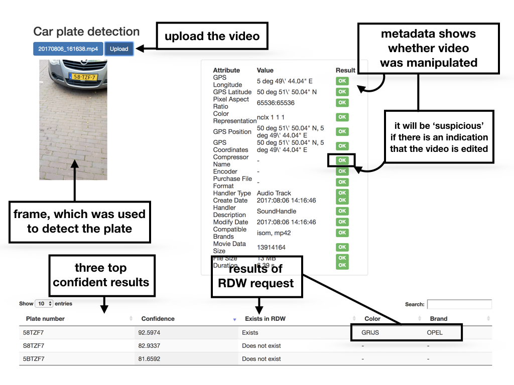

# Documentation for the car license plate recognition tool (CaLPReT)
## 1. Installation
The tool is written in Python 3.5.2. Although untested, it should also work with other Python versions. Following are the dependencies required to successfully use the tool.
### 1.1. Command line tools
The following command line tools are used by the tool:

* **ffmpeg** - partitiones the video into frames (i.e. images, snapshots from the video)
* **mogrify** - converts .jpg to .png images and rotates them (only used when the uploaded file is an image, not a video file), part of ImageMagick suite
* **exiftool** - extracts metadata from the uploaded file
* **alpr** - detects license plate numbers from images/frames (https://github.com/openalpr/openalpr)
### 1.2. Python packages
The following Python packages should be installed:

* **django** - for the user interface
* **cv2** - for image processing tasks (install via “pip install opencv-python”)
* **numpy** - for image processing tasks
* **requests** - HTTP for Humans (install via “pip install requests”)
### 1.3. Running the tool
To run the tool, follow these steps:
1. Navigate to the folder: **carInsuranceUI**
2. Only before the first usage, run the commands:
   1. ```python manage.py makemigrations```
   2. ```python manage.py migrate```
3. Run the command: ```python manage.py runserver```
4. Navigate to: **localhost:8000** in your browser. 
(Note: 8000 is the default port. To use a different port, use the following command to run django: python manage.py runserver 0.0.0.0:*<your_port>*)
5. Upload an image/video file via the user interface.
6. Wait… (can take up to 1-2 minutes, depending on the duration of the video and how early suitable results are found)
7. Enjoy the results!




## 2. Description of the approach
   In general, the CaLPReT tool executes the following steps after a file is uploaded:
1. Saves the file
2. Extracts frames in case of a video file
3. Loops over the frames, in attempt to detect license plates on:
   1. the original frame
   2. the preprocessed frame, where the licence plate is cropped from the image and brought into perspective (if the license plate was tilted in the original image, it becomes straight)
  Stops looping if results are found with sufficient confidence.
4. For each found result, the CaLPReT tool makes a request to the RDW to check if this plate number exists. In case it is, it  adds additional information about the car (color, brand) when possible.

Inspiration for image processing is taken from these tutorials:

* http://www.pyimagesearch.com/2014/04/21/building-pokedex-python-finding-game-boy-screen-step-4-6/
* http://www.pyimagesearch.com/2014/05/05/building-pokedex-python-opencv-perspective-warping-step-5-6/ 

## 3. Discussion on the results
### 3.1. License plate detection
Some cases can be problematic to detect for CaLPReT. Mostly, they fall into the following categories:
1. The plate number is square (not rectangular).
2. The video does not focus on the license plate for a reasonable time. In this case, the license plate on the frames extracted from the video is blurred (not sharp enough).
3. Sometimes the correct plate number is found, but RDW API says this number does not exist.

### 3.2. Video manipulation check
For the video manipulation check, a number of metadata attributes are presented along with the results. These metadata attributes are selected so that they distinguish the “Edited_video.mp4” from other videos. 
In order to make this approach more reliable (currently it is not as it is based on one video only), more labeled data would be needed. (“Labeled” means that along with the video also the information is provided which videos are manipulated and which are not).

### 3.3. Time performance
There is a tradeoff between reliability (being able to find results) and speed of the result search. Current approach generates frames from the video with high granularity (lots of frames are generated) and loops over them until results are found. This process usually takes approximately 30-90 seconds for a single file. If the better time performance is of essence, there are various tricks that can be tried to make the file processing faster. For example:
1. To generate frames with lower granularity.
2. To generate BMP files instead of PNG (for video frames).
3. Decrease the confidence level (in file carInsuranceUI/gui/utils.py, change the constant CONF_LEVEL).

